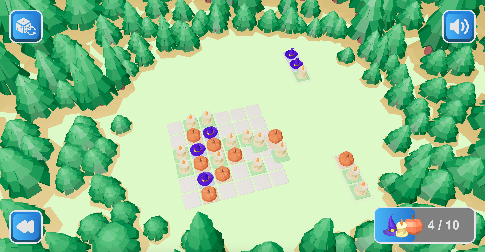

# [Play](https://koraus.github.io/connect-colors/)
# React + TypeScript + Vite + Recoil + react-three-fiber

This is a game based on react & vite & react-three & recoil, in which you have to place identical objects so that their edges touch. It is necessary to place a certain number of objects on the field to win. If there is no more space to place objects, but not all necessary objects have been placed yet, then the game is lost.

