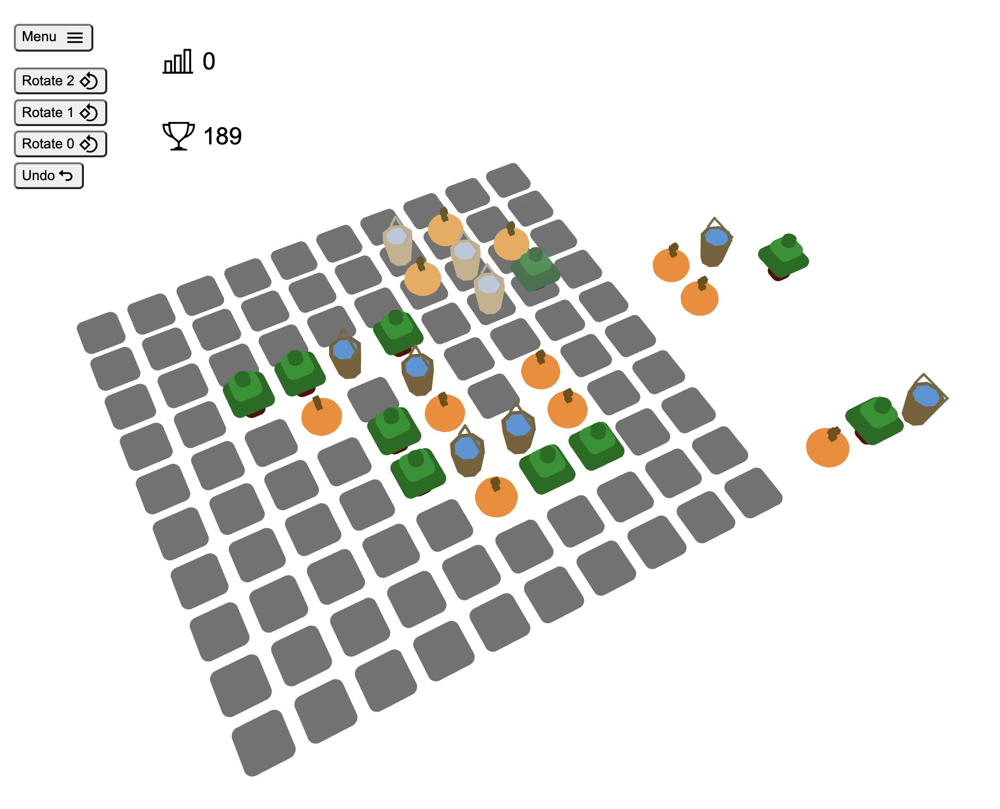

# [Play](https://koraus.github.io/connect-colors/)
# React + TypeScript + Vite + Recoil + react-three-fiber

This is a game based on react & vite & react-three & recoil, in which you have to place identical objects so that their edges touch. You get points for destroying such objects. The bigger the match, the more points you get. The game ends when no more available pieces can be placed on the floor.

